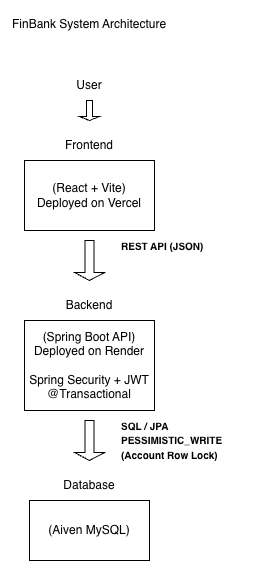
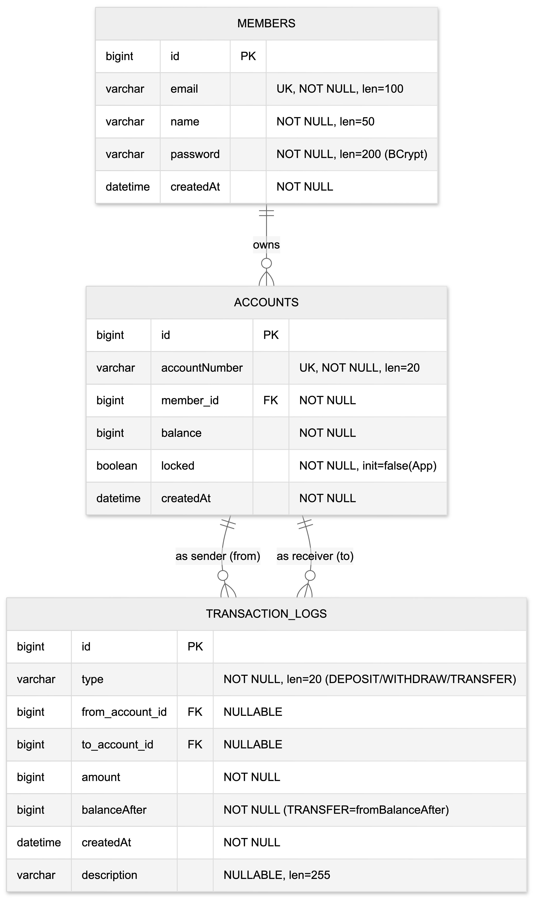

# FinBank

금융 거래의 **무결성과 동시성 문제**를 중심으로 설계한  
백엔드 중심의 금융 서비스 포트폴리오 프로젝트입니다.

실제 배포 환경에서 동작하는 API 서버와 데이터베이스를 기반으로  
인증, 트랜잭션, 동시성 제어를 구현하고 검증하는 데 초점을 두었습니다.

---

## Live Demo

- **Frontend**: https://finbank-frontend.vercel.app
- **Backend API**: https://finbank-backend.onrender.com

> ⚠️ Render 무료 티어 특성상 첫 요청 시 서버 기동에 약 1분 정도 소요될 수 있습니다.

---

##  Tech Stack

### Backend
- Java 17
- Spring Boot 3
- Spring Security
- JWT Authentication
- Spring Data JPA
- MySQL (Aiven)

### Frontend
- React
- Vite
- TailwindCSS

### Infrastructure
- Vercel (Frontend)
- Render (Backend)
- Aiven MySQL (Database)

---

##  System Architecture

본 프로젝트는 프론트엔드, 백엔드, 데이터베이스를 분리하여  
각 계층의 책임을 명확히 하도록 설계했습니다.

- 사용자는 프론트엔드를 통해 요청을 전달합니다.
- 프론트엔드는 REST API(JSON)를 통해 백엔드와 통신합니다.
- 인증, 트랜잭션, 동시성 제어는 백엔드의 책임으로 관리합니다.
- 데이터베이스 접근은 백엔드에서만 이루어집니다.
- 금융 거래의 무결성을 위해 트랜잭션과 **비관적 락(PESSIMISTIC_WRITE)**을 적용했습니다.

---

##  ERD (Entity Relationship Diagram)

계좌(Account)를 중심으로 거래 로그(Transaction Log)를 분리하여  
금융 거래 이력 관리와 검증이 가능하도록 모델링했습니다.

### 주요 설계 포인트
- 회원(Member) 1 : N 계좌(Account)
- 계좌 간 거래는 `TRANSACTION_LOGS` 테이블에서 관리
- 입금 / 출금 / 이체를 하나의 로그 테이블로 통합
- 거래 이후의 잔액(`balance_after`)을 기록하여 이력 추적 가능

---

##  Authentication & Security

- **JWT 기반 인증**을 적용하여 Stateless한 인증 구조를 구성했습니다.
- Spring Security를 통해 인증/인가를 처리합니다.
- CORS 설정을 통해 허용된 프론트엔드 도메인에서만 API 접근을 허용했습니다.

---

##  Transaction & Concurrency Control

금융 서비스에서 가장 중요한 **동시성 문제와 잔액 무결성**을 중점적으로 고려했습니다.

### 트랜잭션 처리
- 모든 금액 변경 로직은 `@Transactional` 범위 내에서 처리합니다.
- 이체 로직은 내부적으로 **Transfer Out / Transfer In** 단계로 분리하여 처리합니다.

### 동시성 제어
- 계좌 조회 시 `PESSIMISTIC_WRITE` 비관적 락을 적용했습니다.
- 동시에 여러 거래가 발생하더라도 잔액 불일치가 발생하지 않도록 설계했습니다.

---

##  Testing

모든 기능을 포괄적으로 테스트하기보다는,  
금융 서비스에서 가장 위험도가 높은 시나리오에 집중하여 테스트를 작성했습니다.

### 테스트 전략
- 동시 이체 상황에서의 잔액 무결성 검증
- 여러 스레드에서 동시에 접근하는 경우에도 데이터 정합성 유지 확인
- CountDownLatch를 활용한 동시성 테스트

> 테스트는 “개수”보다 **위험도가 높은 영역을 정확히 검증하는 것**을 목표로 했습니다.

---

##  프로젝트를 통해 고민한 점

- 금융 거래에서 **어디까지를 데이터 모델로 표현하고**,  
  **어디부터를 비즈니스 로직으로 처리할 것인지**
- 트랜잭션과 락의 적용 범위
- 실제 배포 환경에서의 동작 안정성
- 설계(ERD)와 구현 간의 일관성 유지

---

##  향후 개선 방향

- 거래 로그 조회 성능 개선 (인덱스 / 조회 패턴 최적화)
- 계좌 상태 관리 확장 (휴면, 정지 등)
- 감사(Audit) 관점의 로그 분리
- 대용량 트래픽 상황을 가정한 확장 구조 검토

---

##  마무리

본 프로젝트는 단순한 CRUD 구현이 아닌,  
**금융 도메인에서 중요한 트랜잭션 무결성과 동시성 문제를 직접 설계하고 검증하는 경험**을 목표로 했습니다.

실제 배포 환경에서 동작하는 구조를 통해  
백엔드 설계와 데이터 모델링에 대한 이해를 정리할 수 있었습니다.
